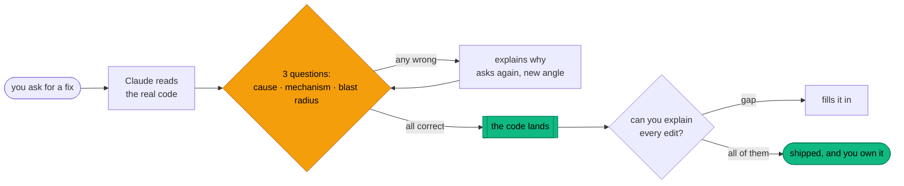

<div align="center">

# 🧠 quiz-me

### The bouncer for your diff.


</div>

```
you     ›  just fix the import bug
claude  ›  sure. first: why does it report 500 imported
           when only 30 rows actually land?
you     ›  ...uhh
claude  ›  (waiting)
```

That's it. That's the plugin.

Claude does the reading, the searching, the typing. You do the one thing that can't be
outsourced: **knowing why.** Nothing gets written until you prove it.

---

## 🎯 Sixty seconds. You're the one being tested.

Real bug. Your users are reporting: *"the import says 500 users imported, 0 failed — but
only about 30 are in the database."*

Claude goes digging and comes back with this:

```js
async function importUsers(rows) {
  const failed = [];

  rows.forEach(async (row) => {
    try {
      await db.insertUser(row);
    } catch (err) {
      failed.push(row);
    }
  });

  return { imported: rows.length - failed.length, failed };
}
```

And then, instead of a diff, it hands you this:

```
┌─ Question 1 of 3 ─────────────────────────────────────────────┐
│                                                               │
│  Why does it report 500 imported when only ~30 rows land?     │
│                                                               │
│   1  insertUser is throwing and the catch swallows it         │
│   2  The pool is exhausted, so late inserts die on exit       │
│   3  forEach ignores the promise the async callback returns,  │
│      so the function returns before any insert finishes       │
│   4  failed.push races between callbacks and loses entries    │
│                                                               │
└───────────────────────────────────────────────────────────────┘
```

**Pick one, then open your answer below.** No cheating — you're inside the demo right now.

<details>
<summary><b>I said 1 — insertUser is throwing and the catch swallows it</b></summary>

<br>

**Wrong, but it's the smart wrong answer.** Here's the tell: if inserts were throwing,
`failed` would be *filling up*. The report came back as `imported: 500, failed: 0` — exactly
`rows.length`. So `failed` was still empty at the moment the function returned.

That's not a swallowed error. That's code that never waited.

</details>

<details>
<summary><b>I said 2 — the pool is exhausted and late inserts die on exit</b></summary>

<br>

**Wrong, but you're circling it.** Something *does* die on exit — you've got the symptom.
But an exhausted pool makes callers wait for a free connection, it doesn't make a function
return early with a fabricated success count.

Ask the sharper question: why did the count get computed *before* any insert had finished?

</details>

<details>
<summary><b>I said 3 — forEach ignores the returned promise ✅</b></summary>

<br>

**That's it.** `forEach` throws the promise on the floor. It calls the async callback, gets
a pending promise back, discards it, and moves to the next row — so `importUsers` reaches
its `return` while all 500 inserts are still in flight.

`failed` is empty because nothing has failed *yet*. The count is a lie told at t=0. Then the
process exits and ~470 pending inserts die with it.

</details>

<details>
<summary><b>I said 4 — failed.push races between callbacks</b></summary>

<br>

**Wrong — and this one's a freebie.** JavaScript is single-threaded. Two callbacks can't be
inside `failed.push` at the same time, so there's no race to lose entries to.

Worth knowing *why* it's not the answer: this bug isn't about concurrency being unsafe, it's
about concurrency never being awaited.

</details>

<br>

Miss it and you don't just get told the answer — you get asked again, reworded, from a new
angle, until it genuinely clicks. Nail all three questions and *now* the code lands.

Then comes the receipt:

```
✅  importUsers.js:4   for...of instead of forEach, so each insert is awaited
✅  importUsers.js:12  return the failed rows, not just a count, so callers retry
⚠️   db.js:22          insertUser takes a client, so the batch shares a transaction

2/3 understood — gap on the shared transaction
```

Every edit named. Nothing bundled, nothing shrugged off as "minor," and **no credit for the
one you couldn't explain.** Then it fills that gap in.

## 🔁 The whole loop



No edit exists anywhere left of that orange diamond. That's the whole design.

---

## ⚡ Install

```
/plugin marketplace add schwann2402/quiz-me-skill
/plugin install quiz-me@quiz-me
```

Told to `Run /reload-plugins to activate.`? Run it.

**Did it land?** Type `/quiz-me:` — you should see `quiz-me` and `review`. Nothing there?
Check `/plugin`.

It's on your machine for every project now, and it will sit there in total silence until you
pick a level. 👇

## 🎚️ Pick your level

| | What happens | Cost to set up |
| :-- | :-- | :-- |
| **1 · On request** | Quizzes you when you ask | nothing |
| **2 · One repo** | Quizzes you on every real change in that repo | one line |
| **3 · Everywhere** | Same, in every project you open | one line |
| **🔒 Hard mode** | Claude *physically cannot* edit until you pass | one small file |

**Level 1** — say `/quiz-me:quiz-me`, or just *"quiz me on this first"*. Done.

**Level 2** — drop this into that project's `CLAUDE.md`:

```markdown
Before implementing any non-trivial change, use the quiz-me skill.
```

Perfect for the one codebase that keeps ambushing you at 2am. Every other repo carries on
blissfully ungated.

**Level 3** — same line, but in `~/.claude/CLAUDE.md`. No repo escapes.

Fair warning: levels 2 and 3 are *instructions*, and instructions get forgotten halfway
through a long session. Which brings us to…

## 🔒 Hard mode

Levels 1–3 are a New Year's resolution. Hard mode is a lock on the fridge.

A hook flat-out denies Claude's editing tools until you've passed, and slams shut again at
the start of every session. Off by default — nobody wants a pop quiz to rename a variable.
Arm it for one repo via `.claude/quiz-me.json`, or for all of them via
`~/.claude/quiz-me.json`:

```json
{ "enforce": true, "ttlMinutes": 240 }
```

- A project file beats the global one — `{ "enforce": false }` exempts any repo.
- `ttlMinutes` = how long one pass keeps the door open. `0` = forever.
- Your repos stay spotless; the pass marker lives in `~/.claude/quiz-me/`.

## 🧊 The surprise exam

Passing a quiz thirty seconds after Claude explained everything? That's not memory, that's
short-term rental.

```
/quiz-me:review 5
```

Grabs your last 5 commits and quizzes you **cold**. No diff. No commit message. Just the
code, as it lives today.

```
3/5 retained — lost the retry backoff, fuzzy on the cache key
```

Humbling. Extremely the point.

## 😴 It's not a jerk about it

Zero quizzes for lookups, formatting, renames, typos, or anything where you already called
the bug *and* the fix yourself. The rule is mechanical: **if Claude had to read more than one
file, you get quizzed.** Otherwise it just does the work.

And when it's 2am and prod is a crater, say **"quiz override."** It ships. No argument, no
justification, no lecture — just one quiet note that the change went out unverified.

A gate you can't bypass is a gate you uninstall. 🚪

## 🧯 Kill switch

- **Just this change** → "quiz override"
- **This repo** → delete the line from its `CLAUDE.md`; set `{ "enforce": false }` if hard
  mode is on
- **Burn it all down** → `/plugin uninstall quiz-me@quiz-me`, then delete
  `~/.claude/quiz-me.json` and `~/.claude/quiz-me/`

No hard feelings.

## 🩺 Something's off

| Symptom | What's happening |
| :-- | :-- |
| It didn't quiz me | Change hit the skip list. Say *"quiz me on this first"* to force it. |
| It quizzed me on something dumb | *"quiz override."* Moving on. |
| Hard mode isn't blocking | Run `python3 --version`. The hook is Python and fails **open** on purpose — no python3, no lock. Then check `enforce` is `true`. |
| It edited before quizzing me | Say *"hold — revert that."* It restores the file and goes back to the quiz. Hard mode makes this impossible. |

**Requirements:** Claude Code. Plus `python3` on your PATH for hard mode. That's the whole
list.

## 🤔 Why bother

Autocomplete-driven development is *gloriously* fast — right up until 2am, when something
explodes inside code you have genuinely never read. Congratulations: you're now debugging a
stranger's work.

The stranger was you. Last Tuesday. 👻

| Claude does | You do |
| :--- | :--- |
| The reading | The **understanding** |
| The searching | The **deciding** |
| The typing | The **knowing why** |

Every "✔️ I reviewed this" checkbox is a lie you tell yourself at speed.

**This one can actually fail you.** That's what makes it worth something.

<div align="center">

⭐ **Star it** if you'd rather understand your codebase than inherit it.

</div>

## 📄 License

MIT — go wild.
